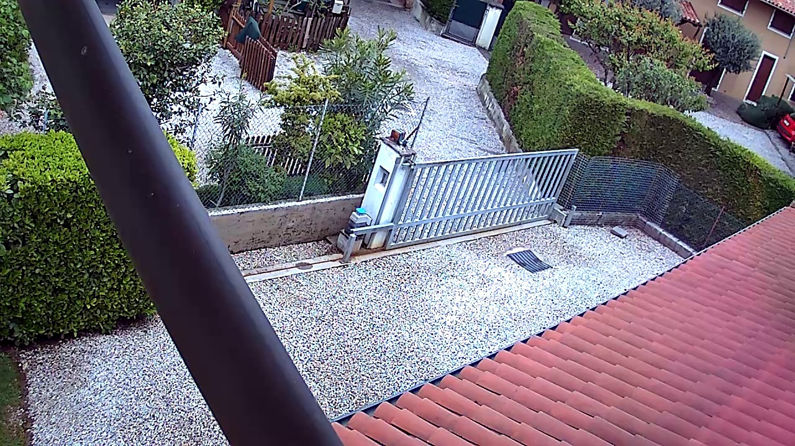
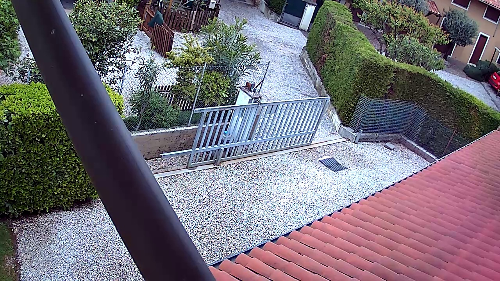
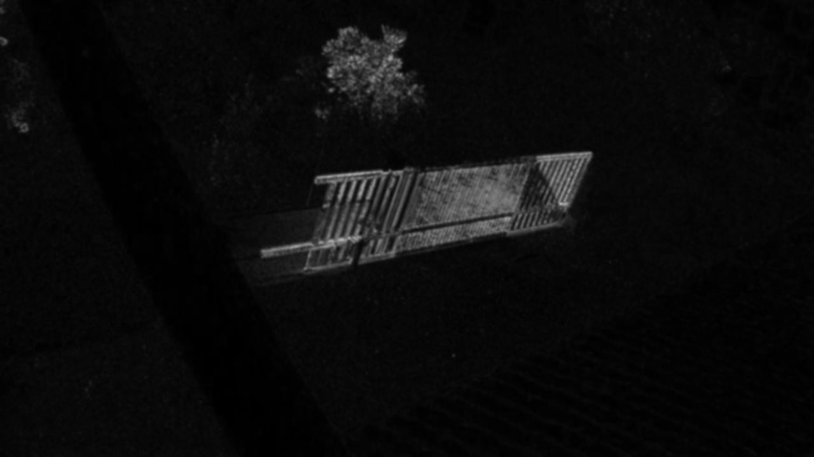

# OpenCV Surveillance

## Features
- HTTP request, with last recorded frame, to a server (eg. so it can be sent via Telegram bot or mail)
- Standard Deviation motion detection
- RTSP ready (or anything which is compatibile with cv2.VideoCapture)

## The HTTP request
The frame is being sent via POST as a image file, in particular the post parameter name is 'file' and the image is being encoded with JPG compression. The request is handled by notification.py.

# Standard deviation
Standard deviation is a statistical calculation, in this case used to compute the difference between two images.

For example the third image is the standard deviation map of the two images above. The final standard deviation of this movement is ~ 18.
You can play around with standard deviation using img_diff.py file.